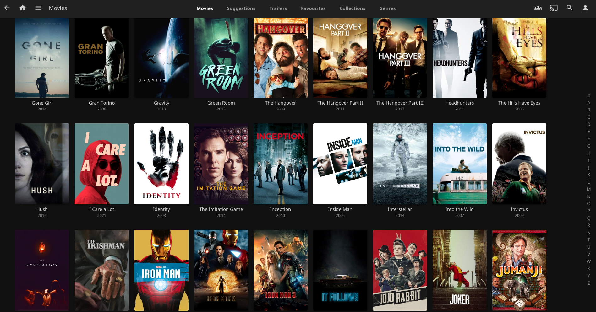
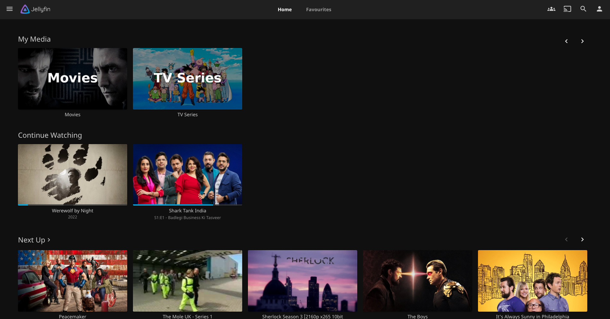
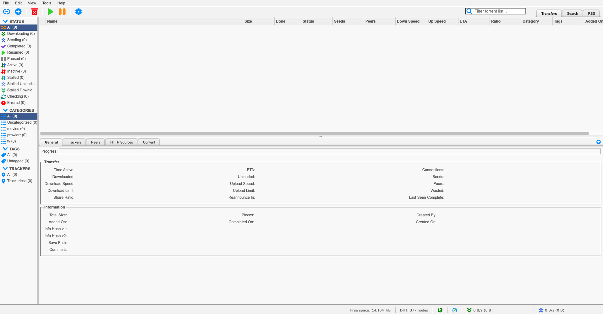
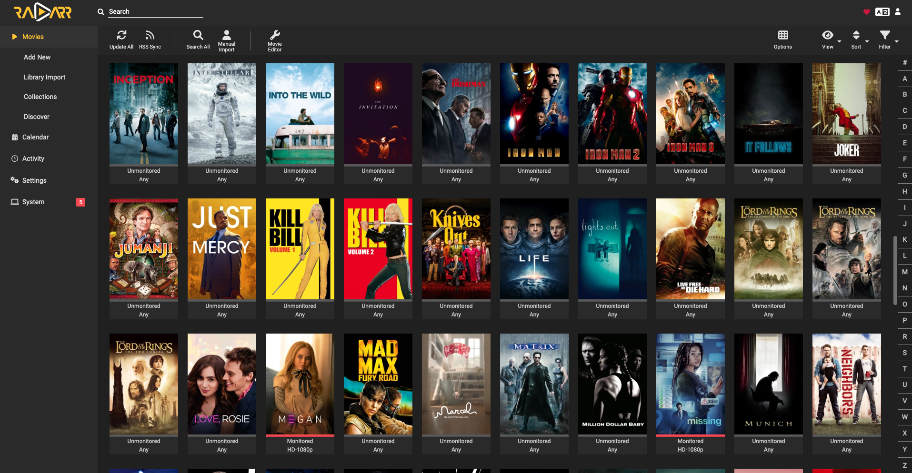
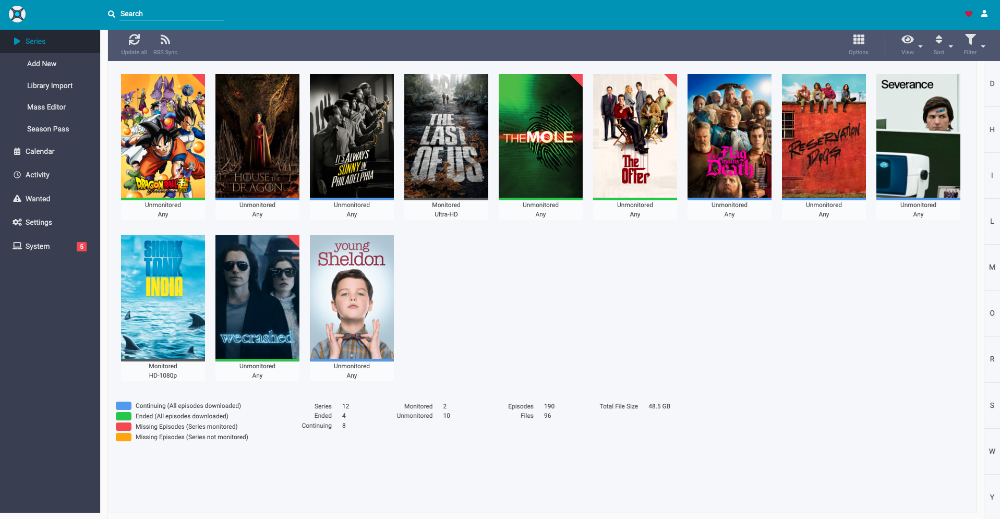
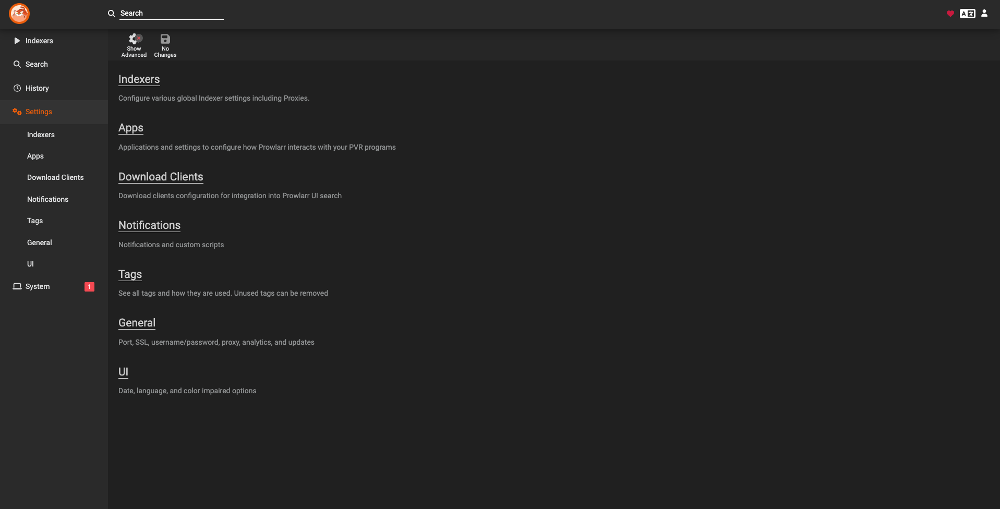

# Home Media Server
Convert any linux machine into a home media server!

_Disclaimer: I'm not encouraging/supporting piracy, this is for information purpose only._

This repository contains the docker-compose file which can be used to launch docker containers to download movies or tv shows & play them using Jellyfin. The scripts have been tested & run on Ubuntu 22.04 LTS.



## Prerequisites
Please make sure you have the following programs installed on your machine:
- docker
- envsubst

Also make sure you have an active __PIA (Private Internet Access) VPN__ subscription.

## Setup
- Replace the values in `.env` file with valid values. 
- Run command `./start.sh`

Example `.env` file:
```
export PIA_VPN_USERNAME=p1234567
export PIA_VPN_PASSWORD=sample_password
export DEFAULT_DOWNLOAD_MEDIA_ABSOLUTE_PATH=/mnt/hdd
export MOVIES_DIRECTORY_ABSOLUTE_PATH=/mnt/hdd/movies
export TVSHOWS_DIRECTORY_ABSOLUTE_PATH=/mnt/hdd/tv
```
`PIA_VPN_USERNAME` -> Enter the username for PIA (Private Internet Access) VPN account.
`PIA_VPN_PASSWORD` -> Enter the password for PIA (Private Internet Access) VPN account.

The above 2 values will be used by qbittorrent docker container to make sure you are connected to the VPN when movies or TV shows are downloaded.

`DEFAULT_DOWNLOAD_MEDIA_ABSOLUTE_PATH` -> This should be the path where qbittorrent will download all the media. You will need to update this later in qbittorrent UI to make sure that movies & TV shows are downloaded to separate paths.

`MOVIES_DIRECTORY_ABSOLUTE_PATH` -> This should be the path from where movies will be loaded by Jellyfin. Please make use of tags feature in qbittorrent & radarr UI to make sure movies are downloaded by qbittorrent to the same path from where movies are loaded by Jellyfin.

`TVSHOWS_DIRECTORY_ABSOLUTE_PATH` -> This should be the path from where TV shows will be loaded by Jellyfin. Please make use of tags feature in qbittorrent & sonarr UI to make sure TV shows are downloaded by qbittorrent to the same path from where TV shows are loaded by Jellyfin.

## Where can I access my services?
You may access the services here:

### Jellyfin
The main app that is used to view the movies & TV series on any device.

http://localhost:8096



### qBittorrent
The app that is used to download the movies & TV series.

http://localhost:8080



### Radarr
The app that is used to monitor & add the downloads for movies to qBittorrent.

http://localhost:7878



### Sonarr
The app that is used to monitor & add the downloads for TV series to qBittorrent.

http://localhost:8989



### Prowlarr
The app that is used to manage the torrent indexers for Sonarr & Radarr.

http://localhost:9696


